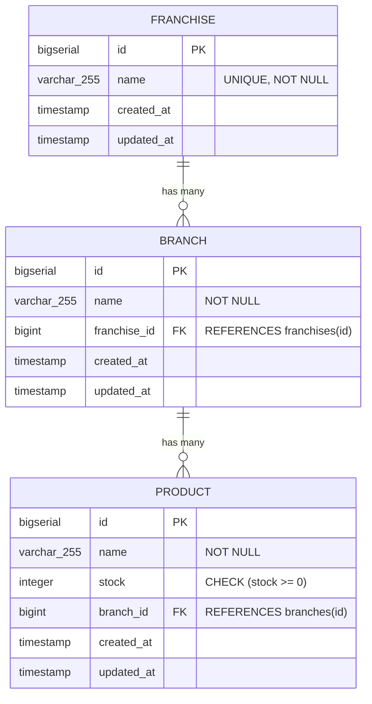
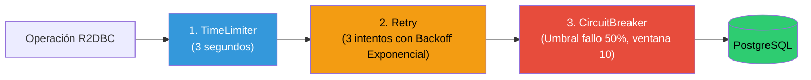
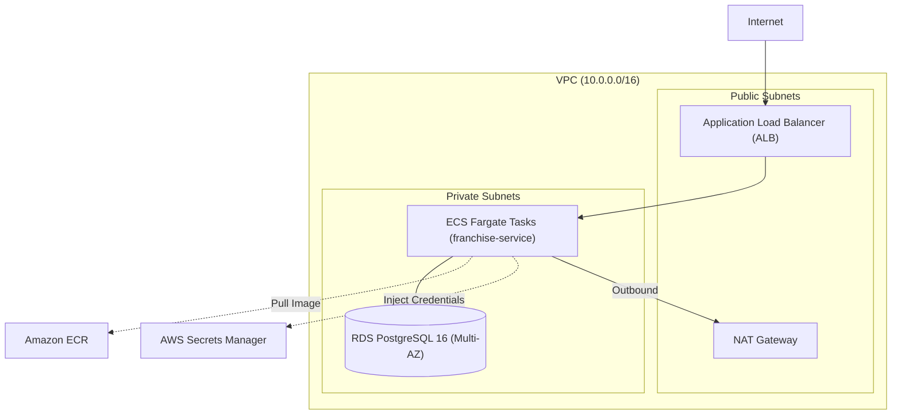

# 🏢 API de Franquicias (Franchise Service) — Reto Técnico Nequi

[](https://www.oracle.com/java/technologies/javase/jdk17-archive-downloads.html)
[](https://spring.io/projects/spring-boot)
[](https://docs.spring.io/spring-framework/reference/web/webflux-functional.html)
[](https://r2dbc.io/)
[](https://resilience4j.readme.io/)
[](https://www.terraform.io/)
[](https://bancolombia.github.io/scaffold-clean-architecture/)

API REST completamente **reactiva y no bloqueante** para la administración de franquicias, sucursales y productos, desarrollada siguiendo los más estrictos estándares de **Arquitectura Hexagonal**, **Programación Reactiva (Spring WebFlux Funcional)**, **Resiliencia (Resilience4j)** e **Infraestructura como Código (Terraform en AWS)** para el proceso de selección técnica de **Nequi**.

---

## 📋 Tabla de Contenido

- [Modelo de Negocio](#-modelo-de-negocio)
- [Pilares Técnicos y Cumplimiento](#-pilares-t%C3%A9cnicos-y-cumplimiento)
- [Arquitectura Hexagonal](#-arquitectura-hexagonal)
- [Matriz de los 9 Endpoints Funcionales](#-matriz-de-los-9-endpoints-funcionales)
- [Resiliencia con Resilience4j](#-resiliencia-con-resilience4j)
- [Documentación OpenAPI / Swagger UI](#-documentaci%C3%B3n-openapi--swagger-ui)
- [Infraestructura en la Nube (AWS + Terraform)](#-infraestructura-en-la-nube-aws--terraform)
- [Ejecución Local](#-ejecuci%C3%B3n-local)
- [Pruebas y Calidad de Código](#-pruebas-y-calidad-de-c%C3%B3digo)

---

## 🏢 Modelo de Negocio

El sistema modela una jerarquía estricta de 3 niveles con integridad referencial:



---

## 🛡️ Pilares Técnicos y Cumplimiento

Este proyecto fue diseñado con **cero concesiones técnicas**, erradicando por completo los errores de descalificación:

| Pilar | Criterio de Evaluación Nequi | Implementación en este Proyecto |
|---|---|---|
| **Pilar 1: WebFlux** | 🚫 **PROHIBIDO `@RestController`** | ✅ 100% `RouterFunction` y `HandlerFunction` funcionales. |
| **Pilar 1: WebFlux** | 🚫 **PROHIBIDO `.block()`** | ✅ 0 llamadas a `.block()` (ni en producción ni en tests). Todo validado con `StepVerifier`. |
| **Pilar 1: WebFlux** | 🚫 **PROHIBIDO `@ControllerAdvice`** | ✅ Manejador global `WebExceptionHandler` (`@Order(-2)`) con buffer reactivo en Netty. |
| **Pilar 1: WebFlux** | 🚫 **PROHIBIDO `try-catch` / `if` en flujos** | ✅ Operadores nativos de Reactor: `filter`, `switchIfEmpty`, `flatMap`, `onErrorResume`. |
| **Pilar 2: Arquitectura** | Hexagonal (Scaffold Bancolombia) | ✅ Dominio puro (sin anotaciones Spring/DB), DTOs como `record`, entidades con `@Builder`. |
| **Pilar 3: Resiliencia** | Patrones completos de resiliencia | ✅ Pila completa de Resilience4j: **Timeout (3s)** + **Retry (exponencial)** + **CircuitBreaker**. |
| **Pilar 4: AWS & IaC** | Terraform modularizado | ✅ 7 módulos Terraform (`networking`, `security`, `rds`, `secrets`, `ecr`, `alb`, `ecs`) con S3 backend. |
| **Pilar 4: AWS & IaC** | Gestión de secretos segura | ✅ Credenciales inyectadas desde AWS Secrets Manager vía ECS Task Definition `valueFrom`. |

---

## 🏛️ Arquitectura Hexagonal

El proyecto utiliza la estructura multi-módulo del plugin Clean Architecture de Bancolombia:

```
java-franchise-service/
├── applications/
│   └── app-service/             # Wiring de Spring Boot, configuración y ensamblado final
├── domain/
│   ├── model/                   # Entidades de dominio puras (Franchise, Branch, Product) y Puertos (Gateways)
│   └── usecase/                 # Casos de uso con las reglas del negocio 100% reactivas
├── infrastructure/
│   ├── driven-adapters/
│   │   └── r2dbc-postgresql/    # Adaptador reactivo R2DBC + Resiliencia Resilience4j + MapStruct
│   └── entry-points/
│       └── reactive-web/        # Routers funcionales, Handlers, WebExceptionHandler y OpenAPI
└── deployment/
    ├── Dockerfile               # Imagen multi-stage optimizada (Eclipse Temurin 17 JRE, non-root)
    └── terraform/               # Infraestructura como Código modular para AWS ECS Fargate
```

---

## 🚀 Matriz de los 9 Endpoints Funcionales

| # | Método | Endpoint | Descripción | Req Body | Res Body | Código Éxito |
|---|---|---|---|---|---|:---:|
| 1 | `POST` | `/api/franchises` | Crear una nueva franquicia | `FranchiseRequest` | `FranchiseResponse` | `201 Created` |
| 2 | `PATCH` | `/api/franchises/{franchiseId}/name` | Actualizar nombre de franquicia | `UpdateFranchiseNameRequest` | `FranchiseResponse` | `200 OK` |
| 3 | `POST` | `/api/franchises/{franchiseId}/branches` | Agregar sucursal a franquicia | `BranchRequest` | `BranchResponse` | `201 Created` |
| 4 | `PATCH` | `/api/branches/{branchId}/name` | Actualizar nombre de sucursal | `UpdateBranchNameRequest` | `BranchResponse` | `200 OK` |
| 5 | `POST` | `/api/branches/{branchId}/products` | Agregar producto a sucursal | `ProductRequest` | `ProductResponse` | `201 Created` |
| 6 | `PATCH` | `/api/products/{productId}/stock` | Modificar stock de producto | `UpdateProductStockRequest` | `ProductResponse` | `200 OK` |
| 7 | `PATCH` | `/api/products/{productId}/name` | Actualizar nombre de producto | `UpdateProductNameRequest` | `ProductResponse` | `200 OK` |
| 8 | `DELETE` | `/api/branches/{branchId}/products/{productId}` | Eliminar producto de sucursal | N/A | N/A | `204 No Content` |
| 9 | `GET` | `/api/franchises/{franchiseId}/max-stock-products` | Producto con mayor stock por sucursal | N/A | `List<ProductResponse>` | `200 OK` |

---

## ⚡ Resiliencia con Resilience4j

Para garantizar alta disponibilidad frente a fallos transitorios y saturación de base de datos, los adaptadores de salida R2DBC (`*RepositoryAdapter`) implementan una pila de resiliencia reactiva de tres niveles:



- **TimeLimiter (3s)**: Si una consulta tarda más de 3 segundos, se cancela para no degradar hilos del EventLoop.
- **Retry con Backoff Exponencial**: Reintenta automáticamente hasta 3 veces solo ante excepciones transitorias de red/conexión (`TransientDataAccessException`, `ConnectException`, `TimeoutException`), espaciando los reintentos (500ms, 1000ms).
- **CircuitBreaker**: Si la tasa de fallo supera el 50% en una ventana de 10 llamadas, el circuito pasa a estado `OPEN`, cortando inmediatamente las solicitudes y protegiendo a la base de datos de una caída en cascada.

---

## 📖 Documentación OpenAPI / Swagger UI

El servicio expone documentación interactiva Swagger generada dinámicamente mediante `@RouterOperations` sobre las funciones de enrutamiento:

- **Swagger UI**: `http://localhost:8080/webjars/swagger-ui/index.html` (o `/swagger-ui.html`)
- **OpenAPI 3.0 JSON Spec**: `http://localhost:8080/v3/api-docs`

---

## ☁️ Infraestructura en la Nube (AWS + Terraform)

Toda la infraestructura está provisionada de forma reproducible en `deployment/terraform/`:



Para desplegar con Terraform:
```bash
cd deployment/terraform/environments/staging
cp terraform.tfvars.example terraform.tfvars
terraform init
terraform plan
terraform apply
```

---

## 💻 Ejecución Local

### Opción 1: Docker Compose (Recomendada)
Inicia la base de datos PostgreSQL 16 y el microservicio reactivo en contenedores:
```bash
docker-compose up -d
```
El script DDL `scripts/init-db.sql` se ejecuta automáticamente al iniciar el contenedor de base de datos.

### Opción 2: Desarrollo Local con Gradle
Asegúrate de tener una instancia de PostgreSQL ejecutándose (o usa `docker run -p 5432:5432 -e POSTGRES_PASSWORD=postgres -e POSTGRES_DB=franchise_db postgres:16-alpine`), y luego ejecuta:
```bash
./gradlew bootRun
```

### Colección de Postman
Importa el archivo `FranchiseService.postman_collection.json` incluido en el repositorio para probar los 9 endpoints con variables configuradas (`{{baseUrl}}`).

---

## 🧪 Pruebas y Calidad de Código

### Ejecutar Pruebas Unitarias y de Integración
```bash
./gradlew test
```

### Reporte de Cobertura JaCoCo
```bash
./gradlew jacocoMergedReport
```
El reporte HTML consolidado se genera en:
`build/reports/jacocoMergedReport/html/index.html`

### Reglas Arquitecturales ArchUnit
El proyecto incluye pruebas automatizadas con **ArchUnit** que verifican:
- Ausencia de dependencias tecnológicas en el dominio.
- Clases de Bean y Casos de Uso con campos estrictamente `final` (inmutabilidad y thread-safety).
- Prohibición de nombres de tecnología en clases y campos de dominio.
