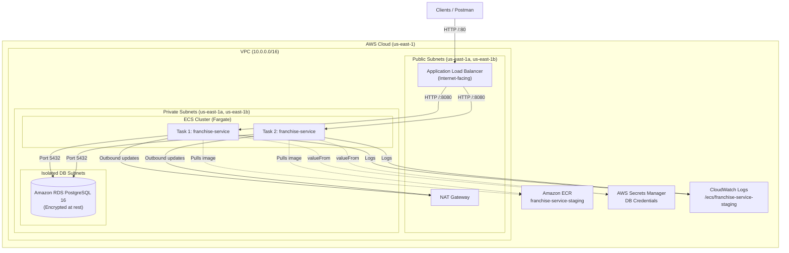

# 🌐 Infrastructure as Code (Terraform) — Franchise Service

This directory contains the modular Terraform infrastructure to deploy the Franchise Service to **AWS ECS Fargate** with high availability, isolated networking, encrypted storage, and secret injection from **AWS Secrets Manager**.

---

## 🏛️ Architecture Overview



---

## 📦 Modules

| Module | Purpose | Key Resources |
|---|---|---|
| **`networking`** | Multi-AZ VPC and routing | `aws_vpc`, 2x public subnets, 2x private subnets, `aws_nat_gateway`, `aws_internet_gateway` |
| **`security`** | Least-privilege network firewalls | ALB SG (80/443 from internet), ECS SG (8080 strictly from ALB SG), RDS SG (5432 strictly from ECS SG) |
| **`ecr`** | Secure container image registry | `aws_ecr_repository` (scan on push), `aws_ecr_lifecycle_policy` (keeps last 10 images) |
| **`rds`** | Relational data persistence | `aws_db_instance` (PostgreSQL 16.1, gp3, KMS encrypted, private subnet group, automated backups) |
| **`secrets`** | Secure credential management | `aws_secretsmanager_secret` with encrypted JSON (`host`, `port`, `dbname`, `username`, `password`) |
| **`alb`** | Traffic distribution and health checks | `aws_lb`, target group with `/actuator/health` probe, listener |
| **`ecs`** | Serverless container orchestration | `aws_ecs_cluster`, task definition (Fargate, 0.5 vCPU, 1 GB RAM, Secrets Manager `valueFrom`), `aws_ecs_service` |

---

## 🔒 Security Best Practices Implemented

1. **Zero Hardcoded Secrets**: Credentials are stored in AWS Secrets Manager and injected dynamically into the container via ECS Task Definition `secrets` block using the syntax `${secret_arn}:key::`.
2. **Private Task Placement**: ECS tasks run in private subnets with no public IP (`assign_public_ip = false`). Inbound traffic is strictly mediated by the ALB.
3. **Defense in Depth (Security Groups)**:
   - Database allows inbound connections **strictly** from the ECS Security Group on port 5432.
   - ECS containers allow inbound connections **strictly** from the ALB Security Group on port 8080.
4. **Encryption at Rest**: RDS storage is encrypted with AWS managed KMS keys (`storage_encrypted = true`).
5. **State Locking**: S3 backend with DynamoDB table prevents concurrent `terraform apply` executions.

---

## 🚀 Deployment Instructions

### Prerequisites
1. [AWS CLI](https://aws.amazon.com/cli/) configured (`aws configure`).
2. [Terraform](https://www.terraform.io/) >= 1.5.0 installed.
3. S3 bucket (`nequi-reto-terraform-state`) and DynamoDB table (`terraform-state-lock`) created for remote state.

### Step 1: Prepare environment variables
```bash
cd deployment/terraform/environments/staging
cp terraform.tfvars.example terraform.tfvars
# Edit terraform.tfvars with your secure database password
```

### Step 2: Initialize Terraform
```bash
terraform init
```

### Step 3: Validate and Plan
```bash
terraform plan -out=tfplan
```

### Step 4: Apply Infrastructure
```bash
terraform apply tfplan
```

### Step 5: Push Docker Image to ECR
```bash
# Authenticate Docker to ECR
aws ecr get-login-password --region us-east-1 | docker login --username AWS --password-stdin <ECR_URL>

# Build, tag and push
docker build -t franchise-service .
docker tag franchise-service:latest <ECR_URL>:latest
docker push <ECR_URL>:latest

# Update ECS Service to deploy new image
aws ecs update-service --cluster franchise-service-staging-cluster --service franchise-service-staging-service --force-new-deployment
```
