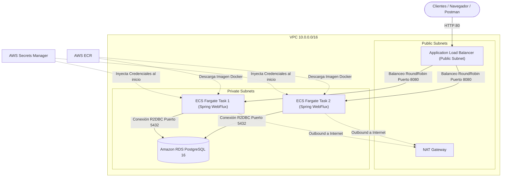

# 📖 Guía Explicativa de Terraform — Reto Técnico Nequi (API de Franquicias)

Este documento detalla, **código en mano**, qué hace cada archivo e instrucción en la infraestructura de Terraform ubicada en `deployment/terraform/`, explicando las decisiones técnicas, su interacción y cómo defenderlas durante la sustentación técnica con el equipo de Nequi.

---

## 🗺️ Índice de Contenidos
1. [Arquitectura General y Flujo de Tráfico](#-arquitectura-general-y-flujo-de-tráfico)
2. [Estructura del Proyecto Terraform](#-estructura-del-proyecto-terraform)
3. [El Backend y Proveedor (`backend.tf`)](#-el-backend-y-proveedor-backendtf)
4. [El Orquestador Principal (`staging/main.tf`)](#-el-orquestador-principal-stagingmaintf)
5. [Módulo a Módulo: Explicación Instrucción por Instrucción](#-módulo-a-módulo-explicación-instrucción-por-instrucción)
   - [5.1 Red y VPC (`modules/networking`)](#51-red-y-vpc-modulesnetworking)
   - [5.2 Seguridad y Firewalls (`modules/security`)](#52-seguridad-y-firewalls-modulessecurity)
   - [5.3 Repositorio de Imágenes (`modules/ecr`)](#53-repositorio-de-imágenes-modulesecr)
   - [5.4 Base de Datos PostgreSQL (`modules/rds`)](#54-base-de-datos-postgresql-modulesrds)
   - [5.5 Gestión de Secretos (`modules/secrets`)](#55-gestión-de-secretos-modulessecrets)
   - [5.6 Application Load Balancer (`modules/alb`)](#56-application-load-balancer-modulesalb)
   - [5.7 Cómputo ECS Fargate e IAM (`modules/ecs`)](#57-cómputo-ecs-fargate-e-iam-modulesecs)
6. [Gestión Segura de Variables y Contraseñas (`.env` vs `tfvars`)](#-gestión-segura-de-variables-y-contraseñas-env-vs-tfvars)
7. [Preguntas de Sustentación Preparadas](#-preguntas-de-sustentación-preparadas)

---

## 🏛️ Arquitectura General y Flujo de Tráfico

La solución implementa una **arquitectura de defensa en profundidad** con segregación estricta de redes públicas y privadas:



---

## 📁 Estructura del Proyecto Terraform

El proyecto sigue una arquitectura **modular y por entornos** (requisito del Pilar 3):

```
deployment/terraform/
├── environments/
│   └── staging/
│       ├── backend.tf            # Configuración de S3 Remote State y AWS Provider
│       ├── main.tf               # Orquestador que conecta los módulos
│       ├── variables.tf          # Definición de variables de entrada con tipos y defaults
│       ├── outputs.tf            # Valores expuestos tras el despliegue (ALB DNS, URLs)
│       └── terraform.tfvars.example # Plantilla de valores para variables sensibles
└── modules/
    ├── networking/               # VPC, Subnets (públicas y privadas), IGW, NAT Gateway
    ├── security/                 # Security Groups encadenados (ALB -> ECS -> RDS)
    ├── ecr/                      # Registro Docker con escaneo y lifecycle policy
    ├── rds/                      # PostgreSQL 16 administrado
    ├── secrets/                  # AWS Secrets Manager para credenciales
    ├── alb/                      # Application Load Balancer y Target Group
    └── ecs/                      # ECS Cluster, Task Definition, Service Fargate e IAM
```

---

## ⚙️ El Backend y Proveedor (`backend.tf`)

Ubicado en `deployment/terraform/environments/staging/backend.tf`:

```hcl
terraform {
  required_version = ">= 1.5.0" # Requiere Terraform moderno para soportar sintaxis avanzada

  required_providers {
    aws = {
      source  = "hashicorp/aws" # Descarga el plugin oficial de HashiCorp para AWS
      version = "~> 5.0"        # Permite actualizaciones dentro de la versión 5.x
    }
  }

  backend "s3" {
    bucket         = "nequi-reto-terraform-state"              # Bucket S3 centralizado
    key            = "staging/franchise-service/terraform.tfstate" # Ruta del estado en el bucket
    region         = "us-east-1"
    dynamodb_table = "terraform-state-lock"                    # Bloqueo atómico contra aplicaciones concurrentes
    encrypt        = true                                      # Encriptación en reposo con KMS
  }
}

provider "aws" {
  region = var.aws_region # Región de despliegue (us-east-1)

  default_tags {
    tags = { # Etiquetas automáticas aplicadas a cada recurso creado
      Project     = var.project_name
      Environment = var.environment
      ManagedBy   = "Terraform"
    }
  }
}
```

### ¿Por qué S3 + DynamoDB?
* **S3**: Almacena el `terraform.tfstate` de manera segura, compartida y versionada, evitando el almacenamiento local.
* **DynamoDB**: Provee **State Locking**. Cuando se ejecuta `terraform apply`, Terraform escribe un candado con un `LockID`. Si otro miembro del equipo intenta aplicar al mismo tiempo, la ejecución es rechazada, previniendo corrupción del estado.

---

## 🎼 El Orquestador Principal (`staging/main.tf`)

Ubicado en `deployment/terraform/environments/staging/main.tf`. Su función es invocar los módulos y canalizar las salidas (*outputs*) de unos como entradas (*inputs*) de otros:

```hcl
module "networking" {
  source               = "../../modules/networking"
  project_name         = var.project_name
  environment          = var.environment
  vpc_cidr             = var.vpc_cidr
  availability_zones   = var.availability_zones
  public_subnet_cidrs  = var.public_subnet_cidrs
  private_subnet_cidrs = var.private_subnet_cidrs
}

module "security" {
  source       = "../../modules/security"
  project_name = var.project_name
  environment  = var.environment
  vpc_id       = module.networking.vpc_id # Recibe la VPC recién creada
}

module "ecr" {
  source       = "../../modules/ecr"
  project_name = var.project_name
  environment  = var.environment
}

module "rds" {
  source             = "../../modules/rds"
  project_name       = var.project_name
  environment        = var.environment
  subnet_ids         = module.networking.private_subnet_ids    # Despliega en subnets privadas
  security_group_ids = [module.security.rds_security_group_id] # Asocia el SG de RDS
  db_name            = var.db_name
  db_user            = var.db_user
  db_password        = var.db_password
  instance_class     = var.db_instance_class
}

module "secrets" {
  source       = "../../modules/secrets"
  project_name = var.project_name
  environment  = var.environment
  db_host      = module.rds.address # Captura el host generado por AWS RDS
  db_port      = module.rds.port
  db_name      = var.db_name
  db_user      = var.db_user
  db_password  = var.db_password
}

module "alb" {
  source             = "../../modules/alb"
  project_name       = var.project_name
  environment        = var.environment
  vpc_id             = module.networking.vpc_id
  public_subnet_ids  = module.networking.public_subnet_ids     # ALB reside en subnets públicas
  security_group_ids = [module.security.alb_security_group_id]
}

module "ecs" {
  source             = "../../modules/ecs"
  project_name       = var.project_name
  environment        = var.environment
  aws_region         = var.aws_region
  private_subnet_ids = module.networking.private_subnet_ids    # Tareas corren en subnets privadas
  security_group_ids = [module.security.ecs_security_group_id]
  target_group_arn   = module.alb.target_group_arn             # Conecta ECS con el balanceador
  ecr_image_url      = module.ecr.repository_url
  image_tag          = var.image_tag
  secret_arn         = module.secrets.secret_arn               # ARN del secreto a inyectar
  cpu                = var.fargate_cpu
  memory             = var.fargate_memory
  desired_count      = var.desired_count
}
```

---

## 🔍 Módulo a Módulo: Explicación Instrucción por Instrucción

### 5.1 Red y VPC (`modules/networking`)

Construye el aislamiento de red en la nube:

* `resource "aws_vpc" "main"`:
  * `cidr_block = "10.0.0.0/16"`: Crea un espacio de direccionamiento privado de hasta 65,536 IPs.
  * `enable_dns_hostnames = true` y `enable_dns_support = true`: Permite resolución de nombres interna para servicios AWS (como RDS y endpoints de servicio).

* `resource "aws_internet_gateway" "main"`:
  * Conecta la VPC a la red pública de Internet. Sin este recurso, la VPC estaría completamente incomunicada.

* `resource "aws_subnet" "public"`:
  * Utiliza `count = length(var.public_subnet_cidrs)` para crear 2 subnets públicas distribuidas en 2 zonas de disponibilidad (`us-east-1a` y `us-east-1b`).
  * `map_public_ip_on_launch = true`: Todo recurso aquí recibe una IP pública (necesario para el ALB).

* `resource "aws_subnet" "private"`:
  * Crea 2 subnets privadas en las mismas zonas de disponibilidad.
  * `map_public_ip_on_launch = false`: Asegura que ni los contenedores ni la base de datos tengan IP pública directa.

* `resource "aws_eip" "nat"` y `resource "aws_nat_gateway" "main"`:
  * **NAT Gateway**: Permite que los contenedores en las subnets privadas puedan hacer peticiones salientes hacia Internet (descargar imágenes de ECR, comunicarse con Secrets Manager) pero **impide que cualquier cliente en Internet inicie conexiones directas hacia ellos**.
  * `allocation_id = aws_eip.nat.id`: Asigna una IP elástica pública estática al NAT Gateway.

* `resource "aws_route_table" "public"` y `private`:
  * La tabla de ruteo pública envía el tráfico `0.0.0.0/0` al **Internet Gateway**.
  * La tabla de ruteo privada envía el tráfico `0.0.0.0/0` al **NAT Gateway**.

---

### 5.2 Seguridad y Firewalls (`modules/security`)

Implementa el principio de **Mínimo Privilegio de Red**:

1. `resource "aws_security_group" "alb"`:
   * Permite entrada (*ingress*) en puertos `80` (HTTP) y `443` (HTTPS) desde `0.0.0.0/0` (cualquier usuario en Internet).
   * Permite salida (*egress*) irrestricta.

2. `resource "aws_security_group" "ecs"`:
   * Entrada (*ingress*): Permite tráfico únicamente en el puerto de la aplicación (`8080`).
   * `security_groups = [aws_security_group.alb.id]`: **Regla de oro**. El contenedor solo acepta paquetes que provengan del Security Group del ALB. Si alguien intenta conectarse directamente a la IP privada de la tarea, la petición es descartada.

3. `resource "aws_security_group" "rds"`:
   * Entrada (*ingress*): Permite tráfico en el puerto PostgreSQL (`5432`).
   * `security_groups = [aws_security_group.ecs.id]`: La base de datos **solo acepta conexiones provenientes de los contenedores ECS**.
   * Salida (*egress*): Bloqueada hacia Internet.

---

### 5.3 Repositorio de Imágenes (`modules/ecr`)

Almacena los artefactos Docker construidos:

* `resource "aws_ecr_repository" "app"`:
  * `image_scanning_configuration { scan_on_push = true }`: Escanea automáticamente la imagen en busca de vulnerabilidades conocidas (CVEs) en cuanto se hace `docker push`.
  * `encryption_configuration { encryption_type = "AES256" }`: Encripta las capas de la imagen en reposo.

* `resource "aws_ecr_lifecycle_policy" "cleanup"`:
  * Regla con `countNumber = 10` y `countType = "imageCountMoreThan"`: Elimina automáticamente imágenes antiguas, manteniendo únicamente las últimas 10 versiones para optimizar costes de almacenamiento.

---

### 5.4 Base de Datos PostgreSQL (`modules/rds`)

Provisiona una base de datos relacional PostgreSQL 16 administrada:

* `resource "aws_db_subnet_group" "main"`:
  * Agrupa las subnets privadas en múltiples zonas de disponibilidad, permitiendo alta disponibilidad.

* `resource "aws_db_parameter_group" "pg16"`:
  * `family = "postgres16"`: Permite ajustar parámetros del motor PostgreSQL.
  * `rds.force_ssl = "0"`: Permite conexiones R2DBC seguras sin forzar certificados complejos en el entorno de pruebas/staging dentro de la red interna de la VPC.

* `resource "aws_db_instance" "postgres"`:
  * `engine = "postgres"`, `engine_version = "16.4"`.
  * `instance_class = "db.t4g.micro"`: Instancia eficiente basada en procesadores ARM Graviton de AWS.
  * `storage_type = "gp3"`, `storage_encrypted = true`: Almacenamiento SSD cifrado mediante AWS KMS.
  * `publicly_accessible = false`: La base de datos es 100% inaccesible desde Internet público.
  * `skip_final_snapshot = true`: Ahorra tiempo y costos al destruir el entorno de pruebas.

---

### 5.5 Gestión de Secretos (`modules/secrets`)

Cumple el mandato estricto de **eliminar credenciales en texto plano**:

* `resource "aws_secretsmanager_secret" "db_credentials"`:
  * Crea una entrada administrada en AWS Secrets Manager protegida por KMS.
  * `recovery_window_in_days = 7`: Protege contra borrados accidentales permitiendo restaurar el secreto hasta 7 días después.

* `resource "aws_secretsmanager_secret_version" "db_credentials_val"`:
  * Almacena las variables empaquetadas en formato JSON:
    ```json
    {
      "host": "rds-endpoint.amazonaws.com",
      "port": "5432",
      "dbname": "franchise_staging",
      "username": "franchise_app_user",
      "password": "..."
    }
    ```

---

### 5.6 Application Load Balancer (`modules/alb`)

* `resource "aws_lb" "main"`:
  * `load_balancer_type = "application"`: Balanceador de Capa 7 (HTTP/HTTPS) con enrutamiento inteligente por URI.
  * `internal = false`: Expuesto a Internet en las subnets públicas.

* `resource "aws_lb_target_group" "app"`:
  * `target_type = "ip"`: Obligatorio para ECS Fargate, ya que Fargate opera con interfaces de red elásticas (ENI) y asigna IPs privadas a cada contenedor.
  * `health_check`:
    * `path = "/actuator/health"`: Consulta el endpoint reactivo de Spring Actuator.
    * `matcher = "200"`: Si el contenedor responde `HTTP 200`, se considera saludable.
    * `healthy_threshold = 2`, `unhealthy_threshold = 3`: Si falla 3 veces consecutivas, el ALB deja de enviarle tráfico automáticamente y ECS reemplaza la tarea caída.

* `resource "aws_lb_listener" "http"`:
  * Escucha en el puerto `80` y reenvía el tráfico (`type = "forward"`) al Target Group de la aplicación.

---

### 5.7 Cómputo ECS Fargate e IAM (`modules/ecs`)

El núcleo de cómputo del microservicio:

#### Roles de IAM (Diferenciación Clave)
1. `resource "aws_iam_role" "ecs_execution"`:
   * Utilizado por el **agente de AWS ECS** antes de iniciar el contenedor.
   * Permite descargar la imagen desde ECR (`AmazonECSTaskExecutionRolePolicy`), escribir métricas y logs en CloudWatch, y consultar el secreto en Secrets Manager (`secretsmanager:GetSecretValue`).
2. `resource "aws_iam_role" "ecs_task"`:
   * Utilizado por el **código Java dentro del contenedor** durante su ejecución.
   * Al no requerir llamadas directas al SDK de AWS desde la lógica de negocio, se mantiene con permisos mínimos.

#### Definición de la Tarea (`aws_ecs_task_definition`)
```hcl
resource "aws_ecs_task_definition" "app" {
  family                   = "${var.project_name}-${var.environment}"
  network_mode             = "awsvpc" # Red dedicada para cada contenedor
  requires_compatibilities = ["FARGATE"]
  cpu                      = 512      # 0.5 vCPU
  memory                   = 1024     # 1 GB RAM

  container_definitions = jsonencode([
    {
      name      = var.project_name
      image     = "${var.ecr_image_url}:${var.image_tag}"
      essential = true

      portMappings = [{ containerPort = 8080, hostPort = 8080 }]

      # Variables no sensibles
      environment = [
        { name = "SPRING_PROFILES_ACTIVE", value = var.environment }
      ]

      # Inyección segura en tiempo de inicio:
      secrets = [
        { name = "DB_HOST",     valueFrom = "${var.secret_arn}:host::" },
        { name = "DB_PORT",     valueFrom = "${var.secret_arn}:port::" },
        { name = "DB_NAME",     valueFrom = "${var.secret_arn}:dbname::" },
        { name = "DB_USER",     valueFrom = "${var.secret_arn}:username::" },
        { name = "DB_PASSWORD", valueFrom = "${var.secret_arn}:password::" }
      ]

      logConfiguration = {
        logDriver = "awslogs"
        options = {
          "awslogs-group"         = aws_cloudwatch_log_group.ecs.name
          "awslogs-region"        = var.aws_region
          "awslogs-stream-prefix" = "ecs"
        }
      }
    }
  ])
}
```
* **Sintaxis `${var.secret_arn}:password::`**: Indica al agente de ECS que consulte el secreto JSON en Secrets Manager y extraiga exclusivamente la clave `password`, pasándola en memoria como la variable de entorno `DB_PASSWORD` al contenedor. Cero exposición en texto plano.

#### Servicio ECS (`aws_ecs_service`)
* `desired_count = 2`: Mantiene 2 instancias simultáneas para garantizar alta disponibilidad en caso de fallo de una zona.
* `launch_type = "FARGATE"`: Cómputo sin servidor (Serverless), sin administración de máquinas virtuales EC2.
* **Rolling Deployment (Zero Downtime)**:
  * `deployment_minimum_healthy_percent = 100`: Nunca apaga los contenedores actuales durante un nuevo despliegue hasta que las nuevas tareas estén 100% activas y saludables en el ALB.
  * `deployment_maximum_percent = 200`: Permite levantar temporalmente el doble de tareas (4 en total) durante el despliegue de una nueva versión.

---

## 🔐 Gestión Segura de Variables y Contraseñas (`.env` vs `tfvars`)

### ¿Cómo pasar la contraseña desde un `.env` a Terraform?

Terraform **no lee archivos `.env` de forma nativa**, pero existen 3 métodos estándar en la industria:

### Método 1: Variables de entorno con prefijo `TF_VAR_` (El más recomendado)
Terraform mapea automáticamente cualquier variable del sistema operativo con el prefijo `TF_VAR_<nombre>` hacia su variable correspondiente `var.<nombre>`.

Si en tu archivo `.env` tienes:
```properties
DB_PASSWORD=MiClaveSuperSegura12345!
```

Puedes exportarla a tu terminal antes de ejecutar Terraform:

* **En Windows PowerShell**:
  ```powershell
  # Extrae la clave del .env y la asigna a la sesión actual:
  $env:TF_VAR_db_password = (Get-Content .env | Select-String "DB_PASSWORD=").ToString().Split("=")[1].Trim()
  
  # Ejecutas Terraform normalmente (la variable se inyecta sola):
  terraform plan
  terraform apply
  ```

* **En Linux / macOS / Git Bash**:
  ```bash
  export TF_VAR_db_password=$(grep DB_PASSWORD .env | cut -d '=' -f2)
  terraform apply
  ```

### Método 2: Archivo `secrets.auto.tfvars` (Ignorado en `.gitignore`)
Terraform carga automáticamente cualquier archivo terminado en `.auto.tfvars`. Puedes crear un archivo local:
```hcl
# secrets.auto.tfvars (NUNCA SUBIR A GIT)
db_password = "MiClaveSuperSegura12345!"
```
Asegúrate de que este archivo esté explícitamente en el `.gitignore`.

### Método 3: Pasar el argumento `-var` por CLI
```powershell
terraform apply -var="db_password=$env:DB_PASSWORD"
```

---

## 🎯 Preguntas de Sustentación Preparadas

| Pregunta del Evaluador | Respuesta Técnica Esperada |
|---|---|
| **¿Por qué usas ALB y no API Gateway?** | "Para este microservicio contenerizado en ECS Fargate, el ALB opera en Capa 7, tiene integración nativa con Target Groups resolviendo las IPs dinámicas de Fargate mediante health checks, y ofrece menor latencia y menor costo. Un API Gateway se justificaría si requiriéramos políticas de API Keys, throttling o monetización en el borde." |
| **¿Por qué modularizaste el código de Terraform?** | "Para seguir los principios de reusabilidad, separación de responsabilidades y facilidad de mantenimiento. Los módulos de `networking`, `rds` o `ecs` son agnósticos y pueden ser reutilizados en entornos de `staging` o `prod` cambiando únicamente las variables." |
| **¿Por qué usas Secrets Manager en lugar de variables de entorno directas?** | "Porque las variables de entorno directas en la definición de la tarea quedan expuestas en texto plano en la consola de AWS y en las llamadas a la API de ECS. Secrets Manager encripta con KMS, audita accesos con CloudTrail y permite rotación sin modificar el código." |
| **¿Por qué tienes dos roles IAM en ECS?** | "El `execution_role` es para el agente de AWS ECS (descarga de ECR, logs en CloudWatch, lectura del secreto). El `task_role` es para el código de la aplicación Java en tiempo de ejecución, siguiendo el principio de mínimo privilegio." |
| **¿Cómo aseguras que el despliegue no tenga caídas (Zero Downtime)?** | "Mediante la configuración del servicio ECS con `deployment_minimum_healthy_percent = 100` y `deployment_maximum_percent = 200`. ECS levanta las nuevas tareas, espera a que el ALB valide el health check `/actuator/health`, y solo entonces drena y termina las tareas anteriores." |
